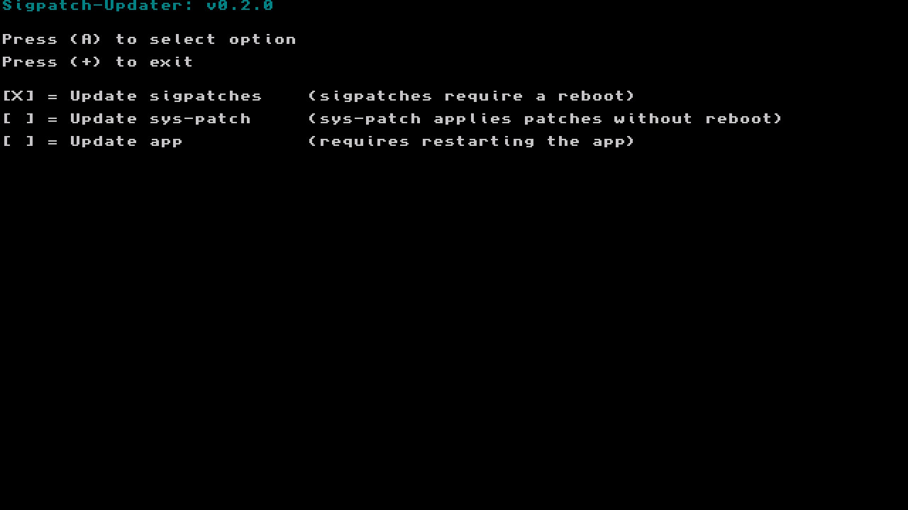

# Sigpatch-Updater

This is a updater for you sigpatches!

Currently it has the option to:

- Update patches needed for Atmosphere
- Update sys-patch and auto run the sysmod
- Update the app

---

----

## Where does it download the patches from?

The patches are download from [a new host](https://sigmapatches.coomer.party). Huge thanks to them!

---

## What is sys-patch?

you can read more about it [here](https://github.com/ITotalJustice/sys-patch).

----

## Special Thanks!

- [toph](https://github.com/sudot0ph) for the design of the app icon
- The-4n for previously updating the sigpatch thread on gbatemp
- Joonie for their help with hekate patches in the past
- TeJay for previously maintaining the patches repo
- Archbox for being very helpful as always
